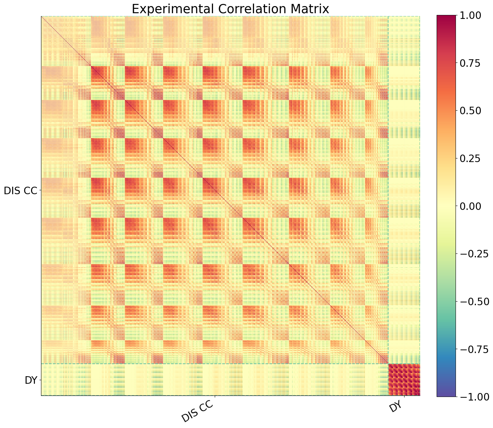

Covariance matrices
-------------------

    [.pdf](figures/default_theory0_plot_normexpcovmat_heatmap.pdf) [#](#default_theory0_plot_normexpcovmat_heatmap)](figures/default_theory0_plot_normexpcovmat_heatmap.png){#default_theory0_plot_normexpcovmat_heatmap} 

Correlation matrices
--------------------

    [.pdf](figures/default_theory0_plot_expcorrmat_heatmap.pdf) [#](#default_theory0_plot_expcorrmat_heatmap)](figures/default_theory0_plot_expcorrmat_heatmap.png){#default_theory0_plot_expcorrmat_heatmap} 

